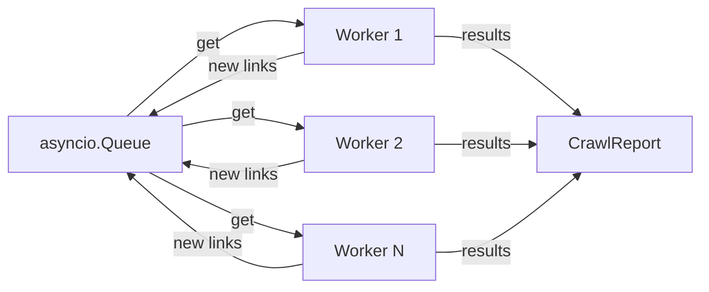

# Three async patterns I used building a broken-link checker

A broken-link checker is the kind of project that begs for async — you're waiting on hundreds of HTTP responses, and doing that sequentially is painfully slow. I built [link_checker](https://github.com/dsdesign-dev/link_checker_async), an async crawler that checks every link on a website, and along the way I leaned on three `asyncio` patterns that keep showing up in real-world async Python code.

<!-- more -->

This post walks through those three patterns using code from the project. The full source is on [GitHub](https://github.com/dsdesign-dev/link_checker_async).

## Pattern 1: Rate limiting with `asyncio.Semaphore`

The first instinct with async HTTP is to fire off all requests at once. That's a good way to get rate-limited, overwhelm the target server, or exhaust file descriptors. A semaphore puts a ceiling on how many requests are in flight at any moment.

Here's the core of `fetcher.py`:

```python
class LinkFetcher:
    def __init__(self, semaphore: asyncio.Semaphore, timeout: aiohttp.ClientTimeout):
        self.semaphore = semaphore
        self.timeout = timeout

    async def check_url(self, session, url, source_url=None, method="GET"):
        start = asyncio.get_running_loop().time()
        try:
            async with self.semaphore:
                async with session.request(method, url, timeout=self.timeout,
                                           allow_redirects=True) as response:
                    # ... process response
        except asyncio.TimeoutError:
            # ... handle timeout
        except aiohttp.ClientError as e:
            # ... handle connection errors
```

The key line is `async with self.semaphore:`. Every call to `check_url` blocks at the semaphore until a slot opens up. If you create `Semaphore(10)`, at most 10 requests run concurrently — regardless of how many workers are pulling URLs off the queue.

!!! tip "Semaphore vs. connection pool"
    `aiohttp`'s `TCPConnector(limit=N)` also caps connections, but that's a transport-level limit. The semaphore is an application-level throttle — you can set it independently to control politeness toward target servers without touching the connection pool.

## Pattern 2: Queue + TaskGroup worker pool

The crawler needs to do a breadth-first crawl: start with one URL, fetch the page, discover new links, check those, discover more links, and so on. The work is dynamic — you don't know the full URL list upfront.

`asyncio.Queue` combined with `asyncio.TaskGroup` gives you a clean worker pool pattern. From `crawler.py`:

```python
async def run(self) -> CrawlReport:
    self.visited.add(self.start_url)
    await self.queue.put(CrawlURL(self.start_url, source_url=None, depth=0, is_internal=True))

    async with aiohttp.ClientSession(connector=aiohttp.TCPConnector(limit=20)) as session:
        async with asyncio.TaskGroup() as task_group:
            workers = []
            for i in range(self.num_workers):
                task = task_group.create_task(self._worker(i, session))
                workers.append(task)

            await self.queue.join()
            for task in workers:
                task.cancel()
    return self.report
```

Each worker runs a simple loop — pull a URL, process it, mark it done:

```python
async def _worker(self, worker_id, session):
    while True:
        crawl_url = await self.queue.get()
        try:
            if crawl_url.is_internal:
                result = await self._process_internal(session, crawl_url)
            else:
                result = await self._process_external(session, crawl_url)
            self.report.add_result(result)
        except asyncio.CancelledError:
            raise
        except Exception as e:
            logger.error(f"worker {worker_id} error on {crawl_url.url}: {e}")
        finally:
            self.queue.task_done()
```

Here's how the pieces fit together:



!!! warning "`queue.join()` must be inside the TaskGroup"
    `queue.join()` blocks until every item has had `task_done()` called. If you put the join *after* the TaskGroup block, the TaskGroup would wait for workers to finish first — but workers loop forever with `while True`, so they never finish. The join must be inside the TaskGroup so it can cancel workers once the queue drains.

!!! note "No lock needed for the visited set"
    The `_enqueue_if_new` method checks `if url in self.visited` and then does `self.visited.add(url)`. This looks like a race condition, but it's not — `asyncio` is single-threaded, and there's no `await` between the check and the add. The coroutine can't be preempted in that window.

## Pattern 3: Graceful shutdown with partial results

When you Ctrl+C a crawl that's checked 50 out of 300 URLs, you still want to see what was found so far. The signal handler and `CancelledError` catch in `__main__.py` make this work:

```python
async def async_main(args):
    loop = asyncio.get_running_loop()
    current_task = asyncio.current_task()
    if current_task:
        for sig in (signal.SIGINT, signal.SIGTERM):
            loop.add_signal_handler(sig, current_task.cancel)

    try:
        link_checker = LinkChecker(start_url=args.url, ...)
        report = await link_checker.run()
        print_report(report)
    except (asyncio.CancelledError, KeyboardInterrupt):
        logger.info("Operation was canceled")
        print_report(link_checker.report)
```

The signal handler calls `current_task.cancel()`, which raises `CancelledError` at whatever `await` is currently active inside `link_checker.run()`. The local variable `report` is never assigned — but that doesn't matter.

!!! tip "Results accumulate on the instance"
    As workers process URLs, they call `self.report.add_result(result)` one at a time. The `CrawlReport` instance on `link_checker` always has the latest partial results. In the `except` block, `link_checker.report` gives you everything collected before the cancellation. If you tried to use the local `report` variable, you'd get a `NameError`.

## Wrapping up

These three patterns — semaphore for rate limiting, queue + TaskGroup for dynamic work distribution, and signal-based graceful shutdown — cover a lot of ground for I/O-bound async Python. They're not specific to link checking; any project that fans out to many network calls can use the same building blocks.

The full source is at [github.com/dsdesign-dev/link_checker_async](https://github.com/dsdesign-dev/link_checker_async).
